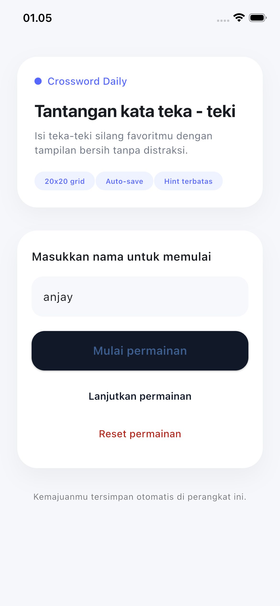
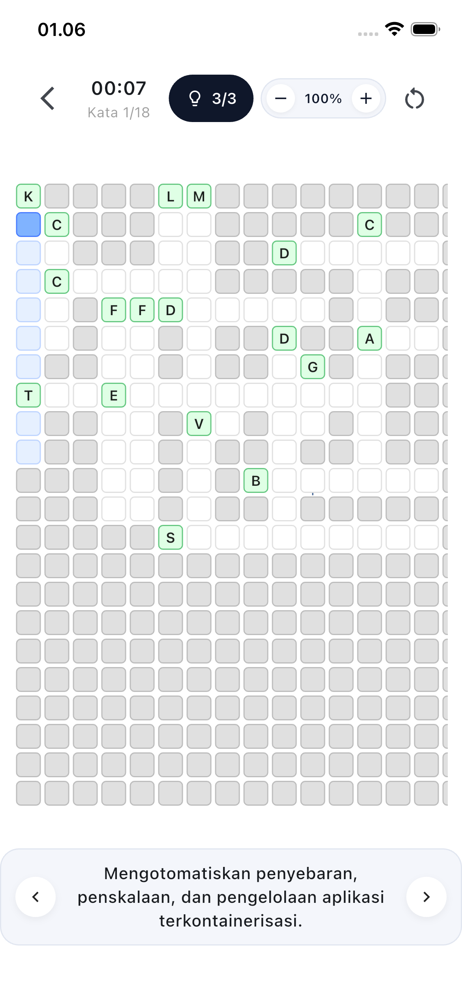
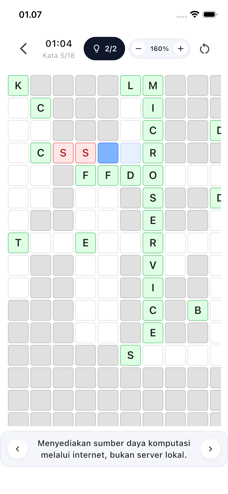

# Crossword - Teka Teki Silang Teknologi

<div align="center">
  
  
  
</div>

## 📱 Tentang Aplikasi

Proyek ini terdiri dari aplikasi Flutter dan layanan backend sederhana untuk memainkan teka-teki silang bertema teknologi. Backend menyediakan puzzle dan clue melalui API agar aplikasi mobile dapat langsung memulai permainan setelah pemain memasukkan nama.

## 🚀 Teknologi yang Digunakan

### Frontend (Flutter)

- **State Management**: Provider
- **Local Storage**: Hive (menyimpan progress game)
- **HTTP Client**: Built-in http package
- **Platform**: Cross-platform (iOS, Android, Web)

### Backend (Python)

- **Framework**: FastAPI
- **Data Format**: JSON
- **AI Integration**: Google Gemini AI (generate clue)
- **CORS**: Middleware untuk cross-origin requests

## 🎮 Fitur Aplikasi

- ✅ Grid crossword 18×18 dengan kata-kata teknologi
- ✅ Clue berbahasa Indonesia dengan animasi typing
- ✅ Sistem hint (bantuan) per kata
- ✅ Timer dan tracking progress
- ✅ Auto-save progress ke local storage
- ✅ Zoom in/out dengan kontrol visual
- ✅ Auto-scroll ke kata aktif saat navigasi
- ✅ Visual feedback: kata yang sudah benar dicoret ~~seperti ini~~
- ✅ Responsive design untuk berbagai ukuran layar

## 🖥️ Backend API (Python / FastAPI)

### Menjalankan secara lokal

```bash
cd Backend
python3 -m venv .venv
source .venv/bin/activate  # Untuk Windows: .venv\Scripts\activate
pip install -r requirements.txt
uvicorn app:app --reload
```

Server akan berjalan di `http://127.0.0.1:8000` dan otomatis menyediakan dokumentasi interaktif di `/docs`.

### Endpoints utama

| HTTP | Path                     | Deskripsi                                           |
| ---- | ------------------------ | --------------------------------------------------- |
| GET  | `/health`                | Pengecekan status sederhana.                        |
| GET  | `/puzzle`                | Mengambil puzzle default (grid, posisi kata, clue). |
| POST | `/start`                 | Memulai sesi baru, membutuhkan `player_name`.       |
| GET  | `/sessions/{session_id}` | Mengambil ulang data sesi yang sudah dimulai.       |

Contoh payload untuk memulai permainan:

```json
{
  "player_name": "Petenteng"
}
```

Respons mencakup `session_id`, `started_at`, dan detail puzzle agar aplikasi Flutter dapat langsung menampilkan papan permainan.

## 📲 Aplikasi Flutter

### Setup dan Instalasi

```bash
# Install dependencies
flutter pub get

# Run aplikasi
flutter run

# Build untuk production
flutter build apk        # Android
flutter build ios        # iOS
flutter build web        # Web
```

### Struktur Project

```
lib/
├── data/           # Models, repositories, storage
├── state/          # State management (Provider)
├── ui/             # Screens dan widgets
└── utils/          # Helper functions
```

### Konfigurasi API

Ubah base URL di `lib/data/repositories/crossword_repository.dart`:

```dart
static const String _baseUrl = 'http://127.0.0.1:8000';
```

## 📝 Lisensi

Proyek ini dibuat untuk keperluan pembelajaran dan pengembangan.
